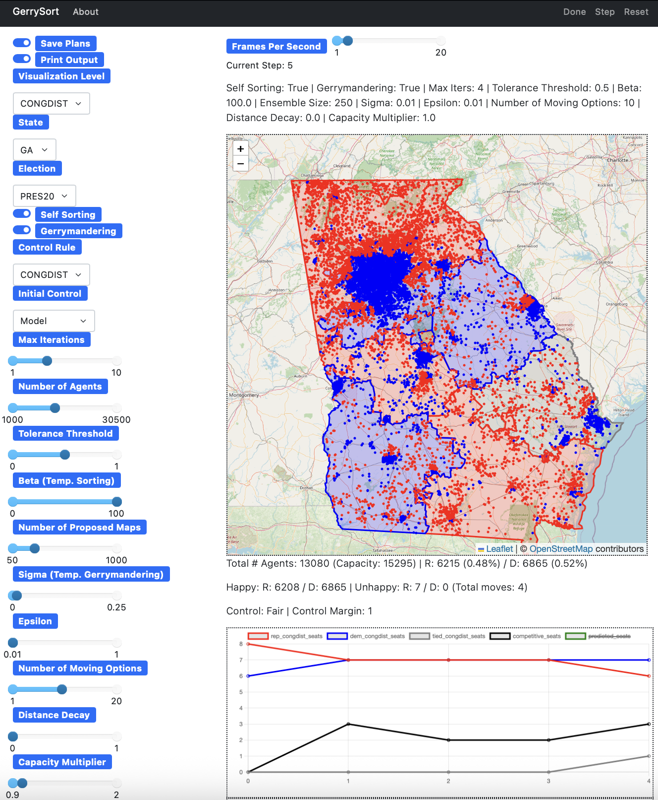

# GerrySort

**GerrySort** is an empirical agent-based model (ABM) for simulating gerrymandering and geographical partisan sorting in U.S. congressional elections. By modeling redistricting strategies (such as gerrymandering) alongside voters' residential preferences and relocation behaviors, GerrySort aims to investigate how these factors collectively shape congressional district maps across different states with diverse political geographies using real-world electoral and demographic data.

<div align="center">
  
  <br>
  <em>Example simulation in interface.</em>
</div>

## Why GerrySort?
Gerrymandering is a classic topic for both scholars and the public. The strange-looking boundaries are often associated with partisan unfairness, uncompetitive elections, and maps of low compactness. However, evaluating the real-life impact of gerrymandering—or more generally, redistricting strategies—requires more than just analyzing gerrymandering itself with static maps; it requires taking into account how voters react to the new map over time. When voters are unhappy with the redistricting, they may relocate, thereby canceling out the impact of gerrymandering. This process is called **partisan sorting**. **GerrySort** is an empirically calibrated agent-based model that allows users to explore the complex interplay between gerrymandering and partisan sorting, as well as their collective impacts on the district map. It has the following features and usages:

## Features:
* Integrates **gerrymandering** and **partisan sorting** into one ABM
* Calibrates the ABM using real-world **precinct-level election data** and **county-level demographics**
* Implements multiple **redistricting scenarios**, including fixed control, model-determined control, and fairness-maximizing redistricting
* Analyzes maps and evaluates redistricting reforms using multiple metrics for partisan fairness, compactness, competitiveness, and segregation

## Use Cases:
* Evaluate how partisan sorting affects gerrymandering outcomes and vice versa
* Generate congressional district maps under different political control scenarios using advanced algorithms
* Assess the effectiveness of redistricting reforms under different political geographies in multiple U.S. states
* Measure partisan segregation of the maps using spatial statistics (e.g., Moran’s I)

---

## Repository Structure 
<pre lang="markdown">
<code>GerrySort-ABM/ 
    ├── data/                     # Input data: shapefiles, election results, RUCA codes
    ├── gerrysort/                # Core agent-based model code
    ├── run_console.py            # Script to run simulations via command line
    ├── run_visualization.py      # Script to run the interactive visual interface
    └── environment.yml           # Conda environment
</code></pre>

## Installation  
1. **Clone the repository**
   ```
   git clone https://github.com/aM0NKE/GerrySort-ABM.git
   cd GerrySort-ABM
   ```

2. **Install dependencies**
    ```
    uv venv
    uv sync
    ```

## Usage Options  
* **To run a simulation in your console:**
    ```
    uv run run_console.py
    ```

* **To run the interactive simulation interface:**
    ```
    uv run run_visualization.py
    ```

---

## Citation
If you use this model in your research, please cite:
> Vaudrin, R., Tang, T., Lees, M.H. (2026). GerrySort: An Empirical Agent-Based Model for Simulating Gerrymandering and Geographical Partisan Sorting. 

## License
This project is licensed under the MIT License. See the LICENSE file for details.

## Acknowledgments
* Precinct shapefiles, congressional maps, and election data: [Districtr (MGGG Redistricting Lab)](https://districtr.org)
* RUCA codes: [U.S. Department of Agriculture](https://www.ers.usda.gov/data-products/rural-urban-commuting-area-codes)
* County-level demographic data: [Index Mundi](https://www.indexmundi.com/facts/united-states/quick-facts/all-states/)
